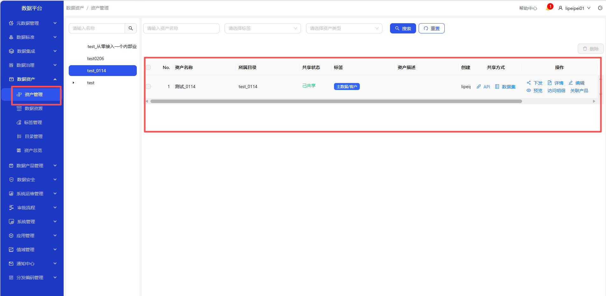
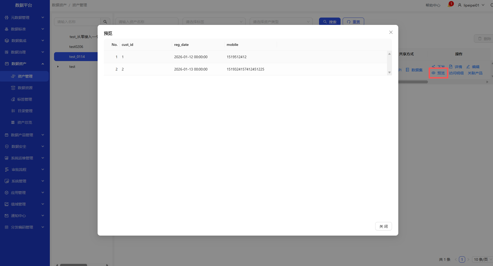
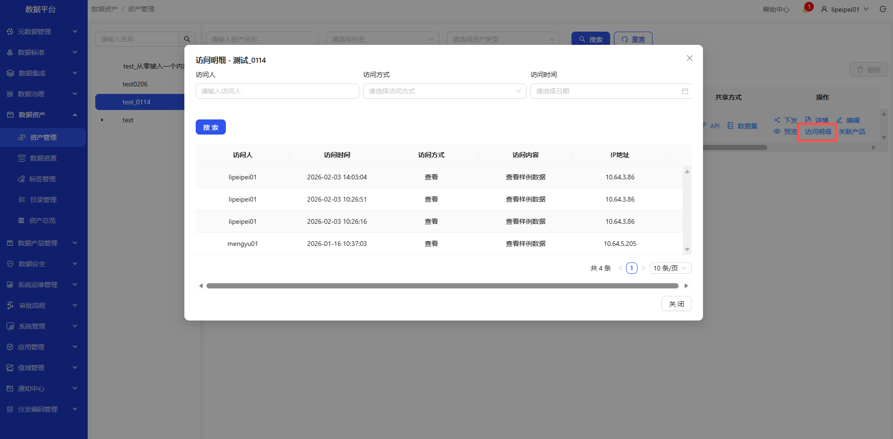
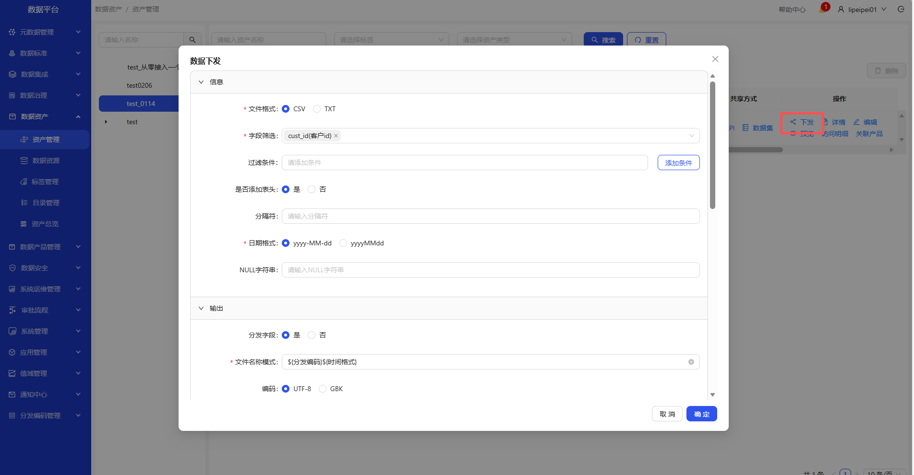

# 资产管理
操作界面示例截图（按步骤依次操作）

&emsp;
&emsp;
&emsp;
&emsp;
&emsp;
&emsp;

&emsp;
&emsp;
&emsp;

&emsp;1. 进入数据资产-资产管理页面\
&emsp;2. 可查看资产详情、访问明细(在数据资产-资产总览查看数据或者下载数据后可查看)，可编辑、预览资产\
&emsp;3. 点下发按钮，进行资产数据下发\
&emsp;4. 共享方式的操作示例可在数据产品管理查看