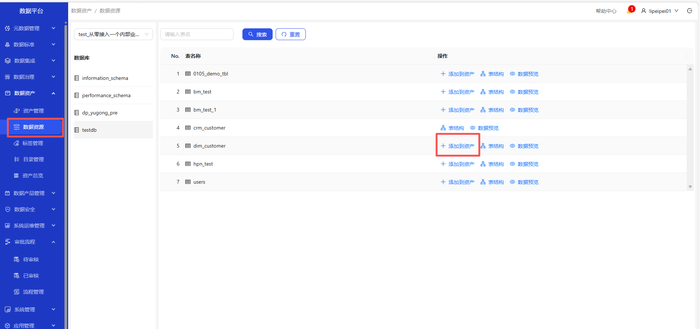

# 数据资源
操作界面示例截图（按步骤依次操作）

&emsp;
&emsp;
&emsp;
&emsp;
&emsp;
&emsp;

&emsp;
&emsp;

&emsp;1. 进入数据资产-数据资源页面\
&emsp;2. 选择建立的数据源\
&emsp;3. 选择数据库和要创建资源的表\
&emsp;4. 点击添加到资产的按钮，选择已建立的目录和标签，填写相关信息，点击确定按钮，成功创建资产\
&emsp;5. 可查看表结构和表数据预览