# 数据治理

操作流程总览图

### 主题表
操作界面示例截图（按步骤依次操作）

1. 进入数据治理-主题表页面
2. 点击新建，选择元数据目录和数据库，新建主题表
3. 可搜索、编辑、删除新建的主题表

### 主题集
操作界面示例截图（按步骤依次操作）

1. 进入数据治理-主题集页面
2. 点击+，新建主题集
3. 选中主题集，点击添加主题表按钮，新建主题表
4. 可查看、删除新建的主题集
5. 选中主题集，可删除其主题表

### 治理模型
操作界面示例截图（按步骤依次操作）

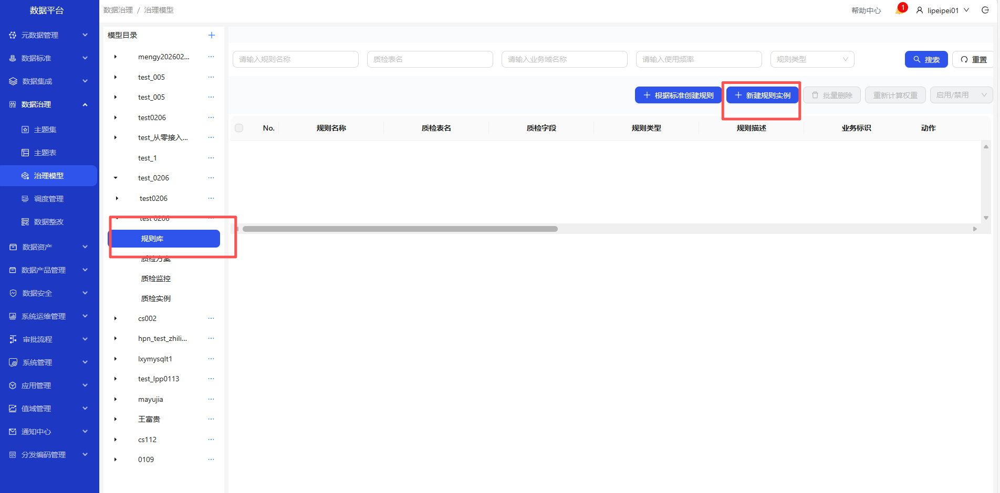

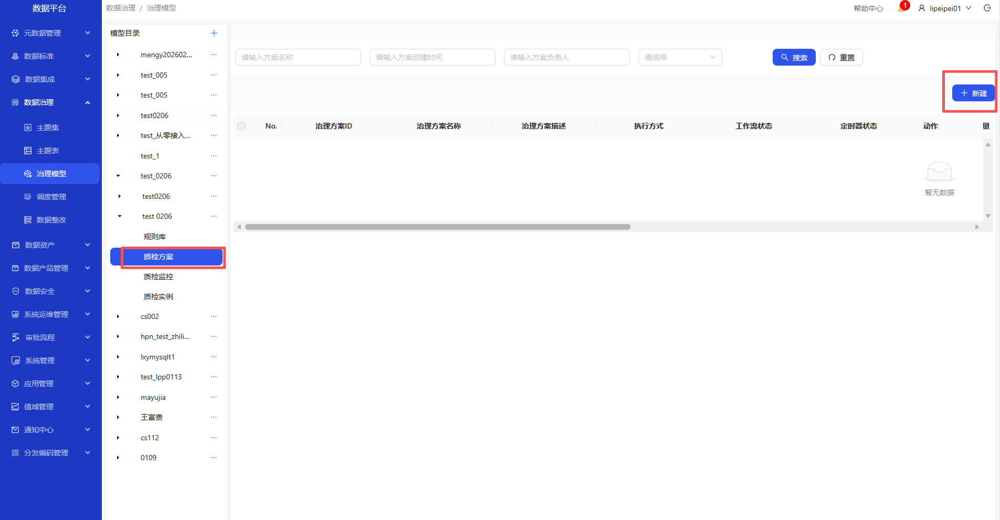

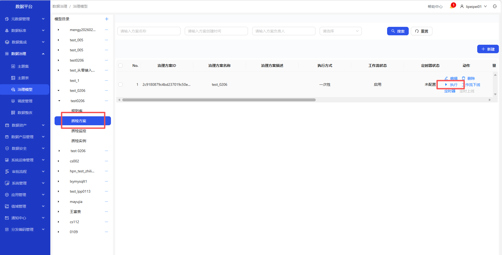
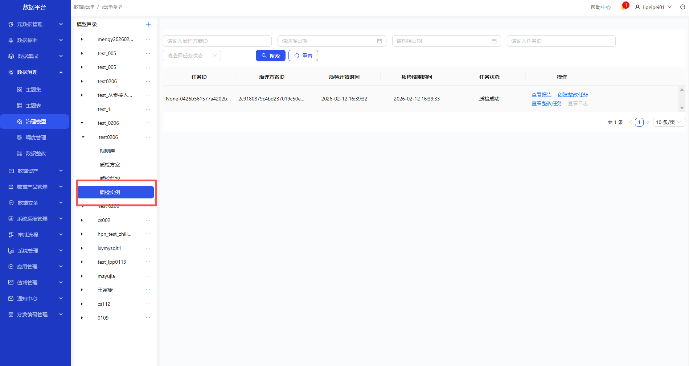

1. 进入数据治理-治理模型页面
2. 点击+或者创建目录按钮，新建目录
3. 选中创建的目录，新增模型
4. 选中模型，新增主题表
5. 选中模型，点击规则库，新建规则实例(以校验单个字段长度检查为例)，可编辑、删除规则实例
6. 选中模型，点击质检方案，新建质检方案，点击执行
7. 选中模型，点击质检实例，可查看质检实例详情
8. 选中模型，点击质检监控，可查看质检监控结构

### 数据整改
操作界面示例截图（按步骤依次操作）

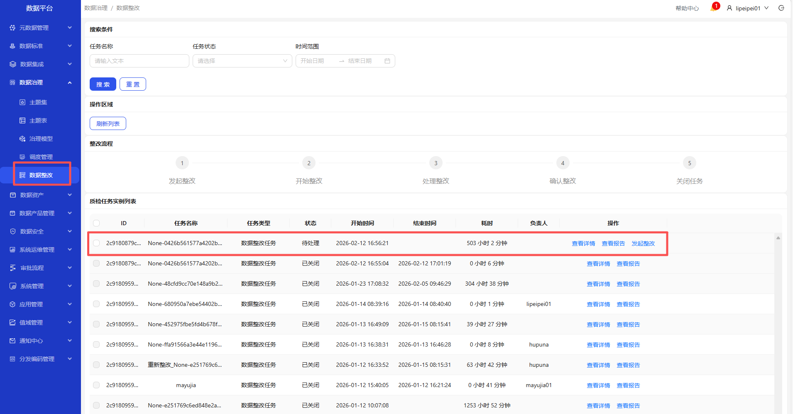

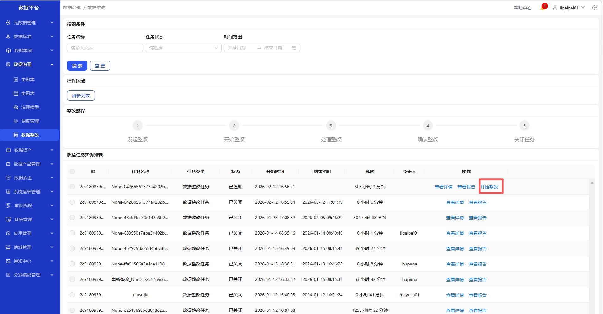

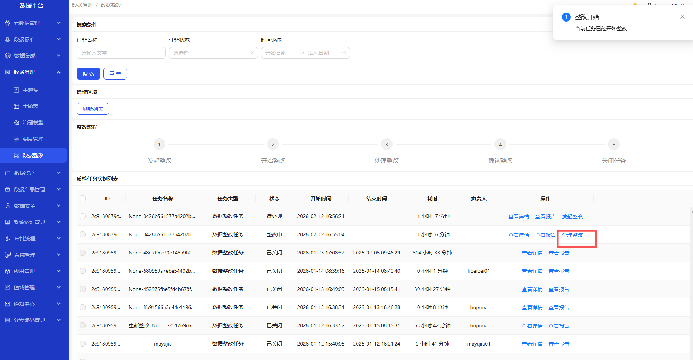
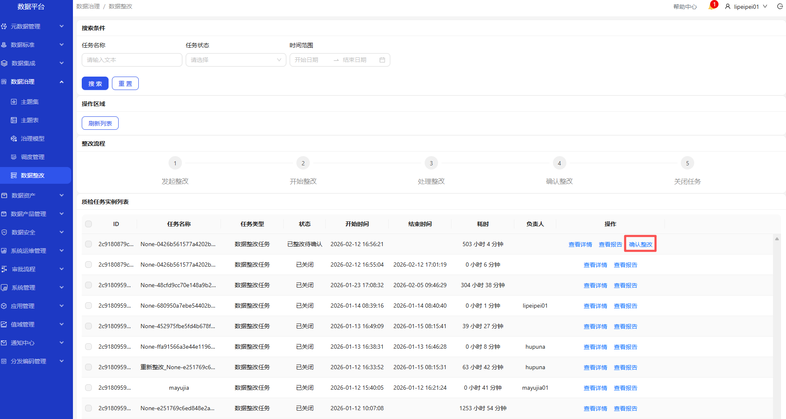
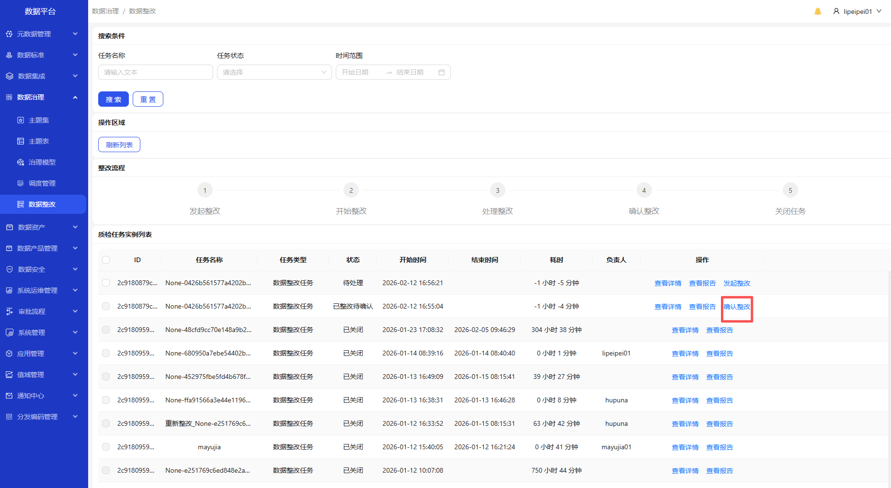
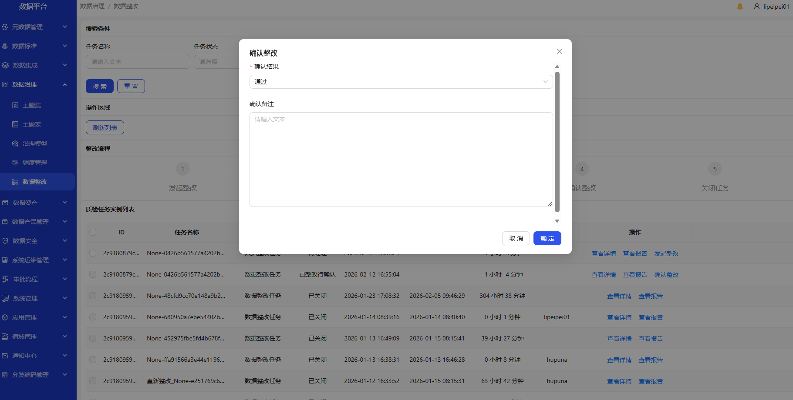
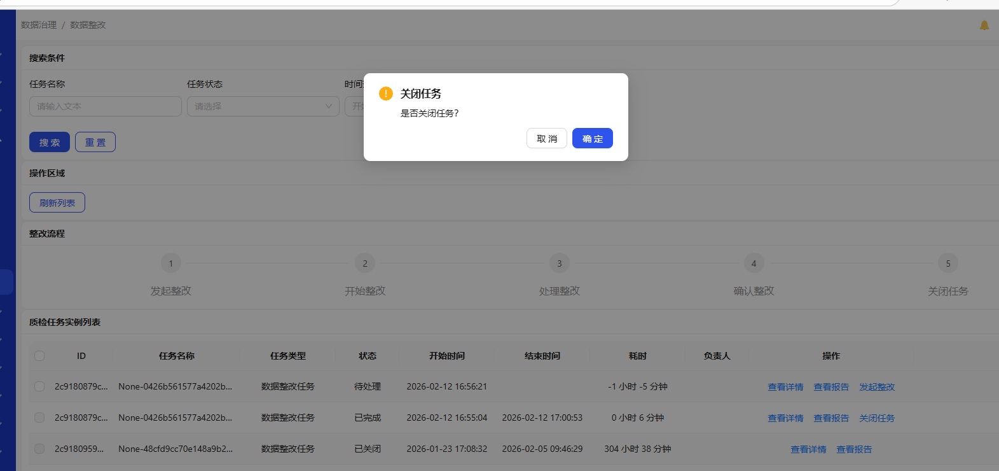

1. 进入数据治理-数据整改页面
2. 选中要整改的任务，整改负责人点击发起整改
3. 成功发起整改后，表负责人点击开始整改
4. 整改负责人点击确认整改，通过；点击关闭任务，整改任务进行关闭
5. 可查看任务详情和报告

### 调度管理
操作界面示例截图（按步骤依次操作）

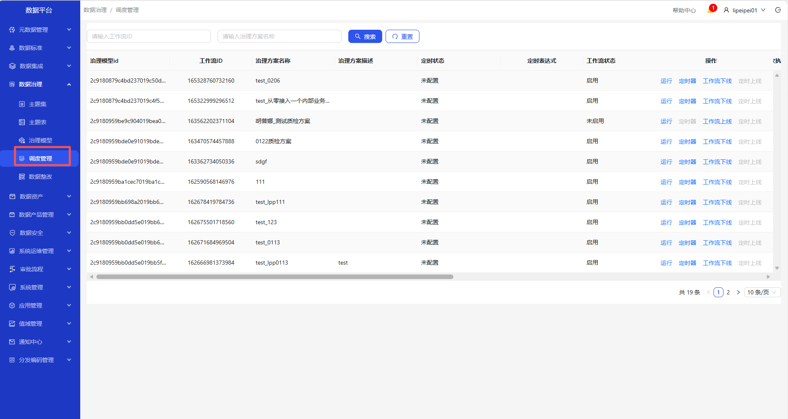

1. 进入数据治理-调度管理页面
2. 查看所有质检方案
3. 可运行、定时、上下线