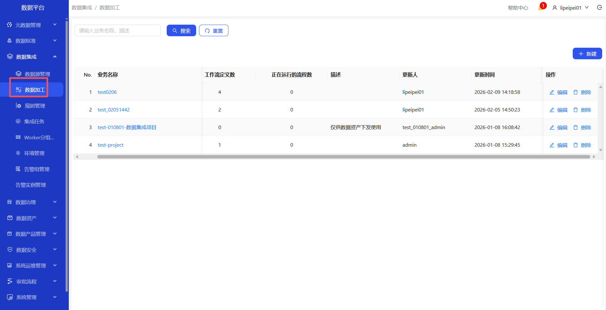
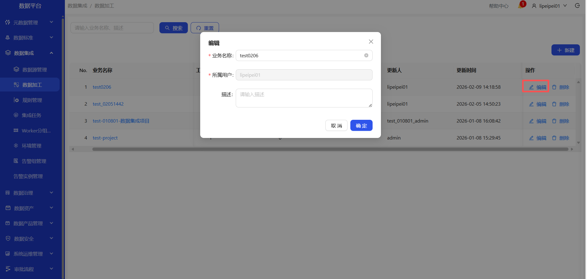
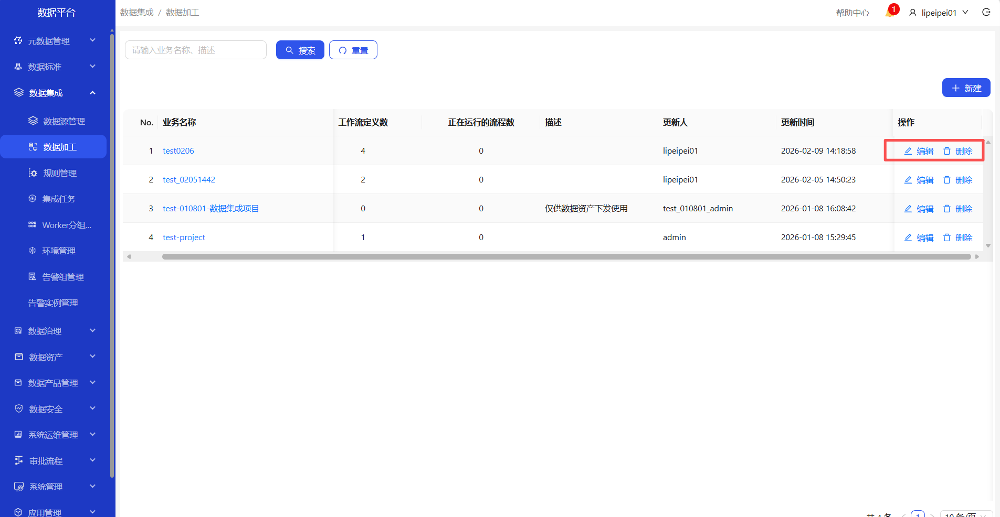
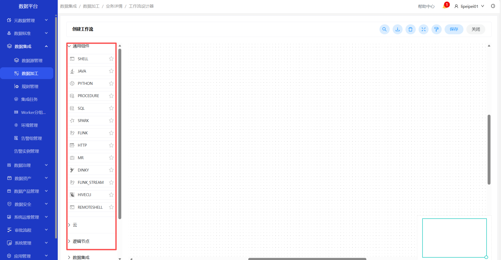
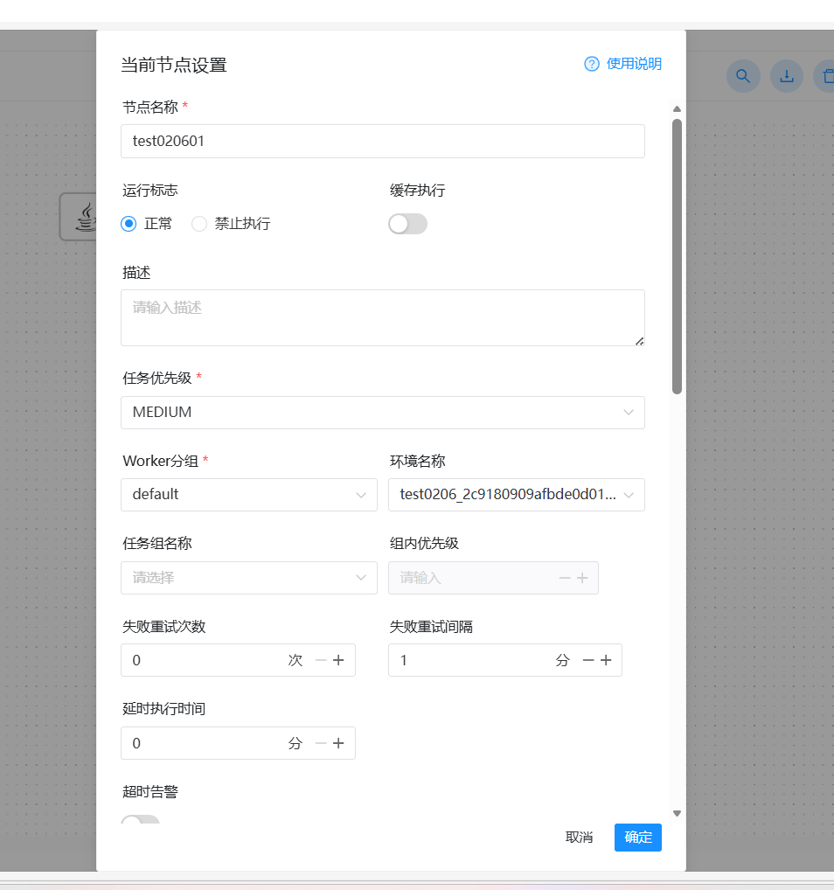
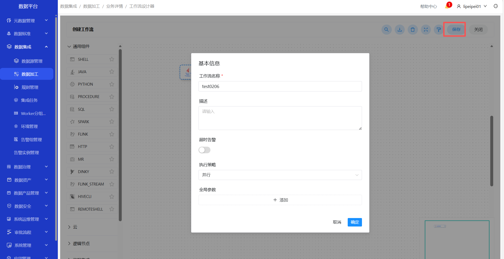
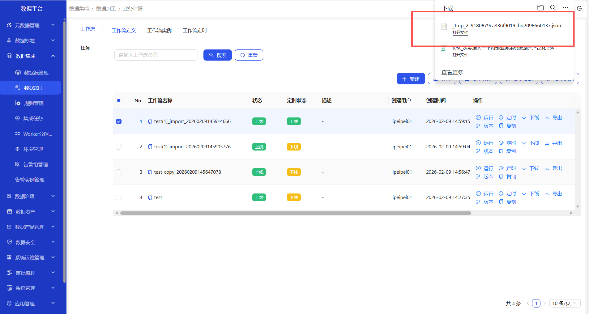
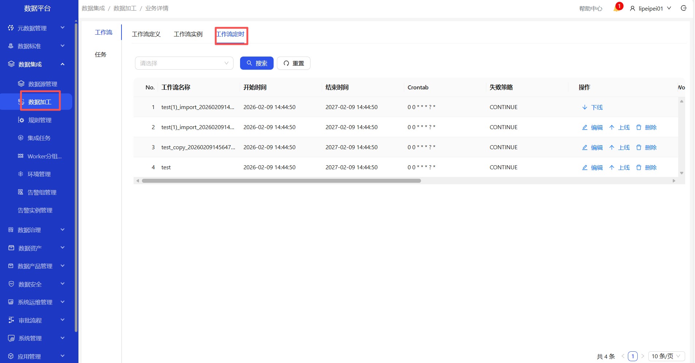
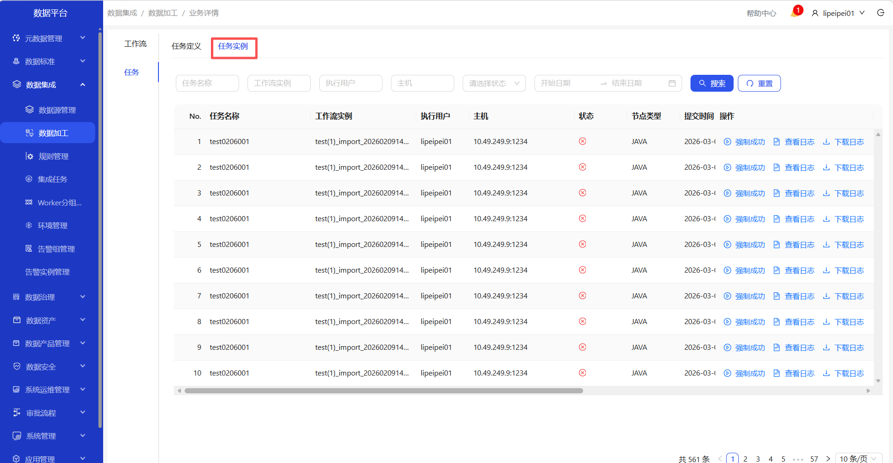

# 数据加工
操作界面示例截图（按步骤依次操作）

&emsp;
&emsp;
&emsp;
&emsp;
&emsp;
&emsp;

&emsp;
&emsp;
&emsp;
&emsp;
&emsp;
&emsp;

&emsp;
&emsp;
&emsp;
&emsp;
&emsp;
&emsp;

&emsp;
&emsp;
&emsp;
&emsp;

&emsp;1. 进入数据集成-数据加工页面\
&emsp;2. 点击新建，输入业务名称，可新建业务\
&emsp;3. 可对新建的业务进行编辑、删除\
&emsp;4. 点击业务名称，进入工作流定义页面\
&emsp;5. 点击新建，进入工作流设计器页面，拖到左侧的组件到右边的画布上，填写完整的信息\
&emsp;6. 创建成功后，点击保存按钮，新建工作流\
&emsp;7. 创建的工作流，点击上线，上线工作流\
&emsp;8. 上线成功后，点击运行；填写完整的数据后，点击确定按钮，运行工作流\
&emsp;9.  可对工作流进行编辑和删除(下线的状态)\
&emsp;10. 可对工作流定时、上线、下线、导入、导出、查看版本的操作\
&emsp;11. 标签切换至工作流实例，可查看工作流实例数据(上线且运行)\
&emsp;12. 标签切换至工作流定时，可查看工作流定时数据(上线且设置定时)\
&emsp;13. 标签切换至任务-任务定义，可查看任务定义数据\
&emsp;14. 在任务定义页面，可新建工作流下的任务\
&emsp;15. 标签切换至任务-任务实例，可查看任务实例数据