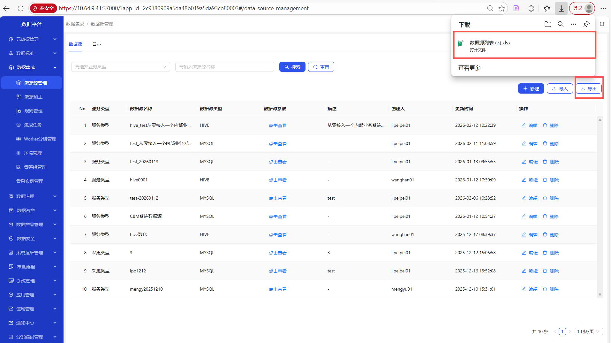
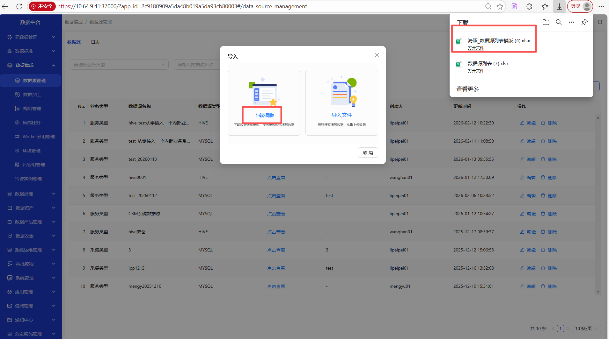
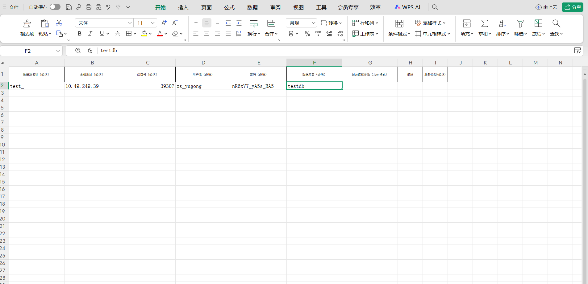
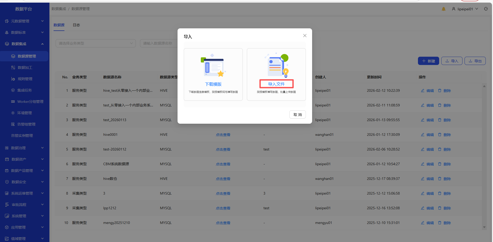

# 数据源管理
操作界面示例截图（按步骤依次操作）

1. 进入数据集成-数据源管理页面
2. 点击新建按钮，选择数据库类型，新建数据源
3. 填写完成的数据，点击测试连接，显示连接成功；点击确定，数据源创建成功；在数据源列表页面可查看新建的数据源
4. 点击查看，可查看数据源参数详情
5. 点击编辑，可对数据源进行编辑
6. 点击删除，可删除数据源
7. 点击导出，可导出数据源
8. 点击导入，下载模板；填写数据后，点击导入文件，可成功导入数据源