# 集成任务
操作界面示例截图（按步骤依次操作）

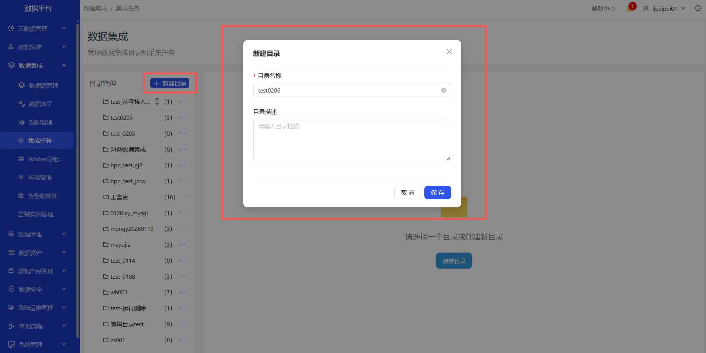
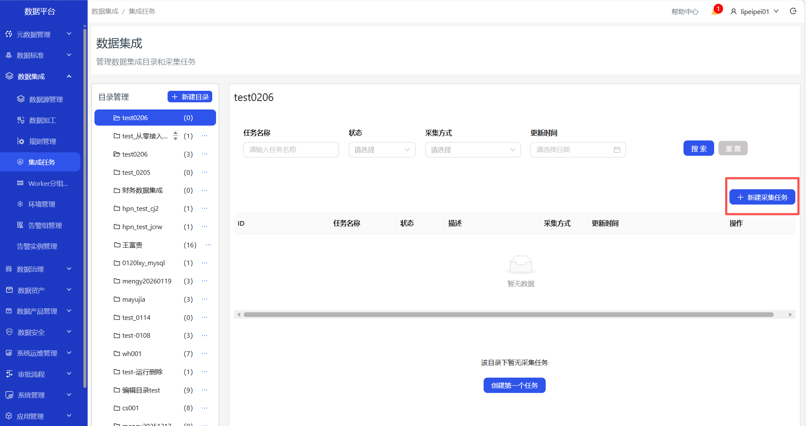
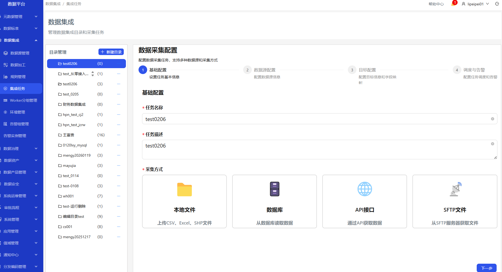
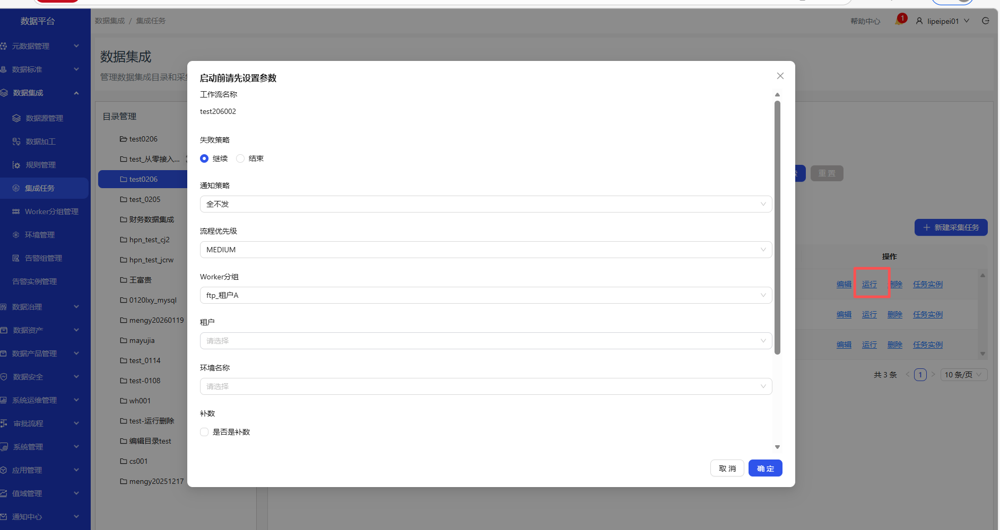

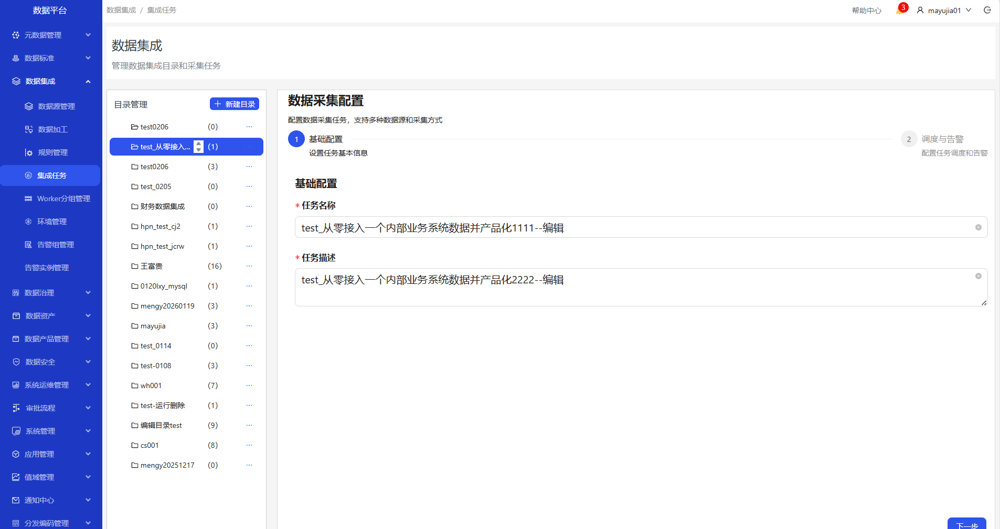
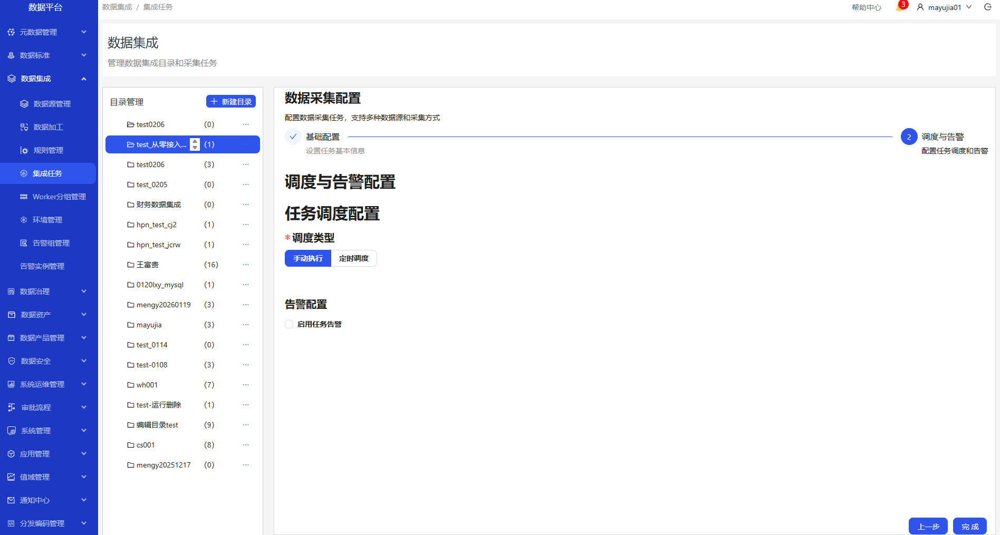

1. 进入数据集成-集成任务页面
2. 创建目录
3. 选中创建的目录，创建采集任务
4. 填写任务名称等参数，点击完成，成功创建采集任务
5. 成功创建任务后，可运行，删除该任务
6. 点击任务实例，打开新窗口展示该任务的任务实例
7. 点击编辑，可编辑任务

#### 本地文件类型任务

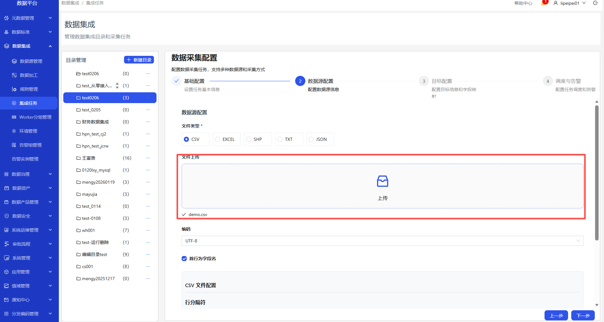

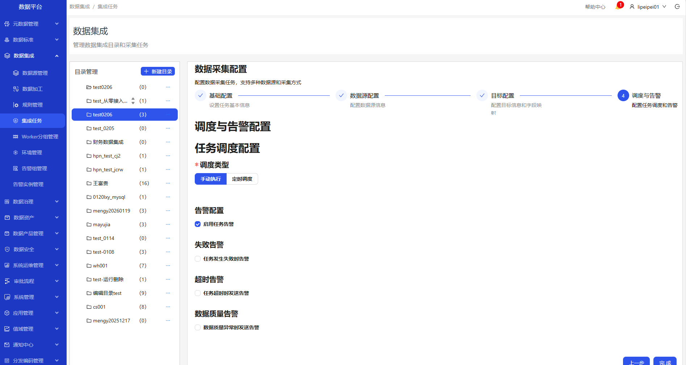

#### 数据库类型任务

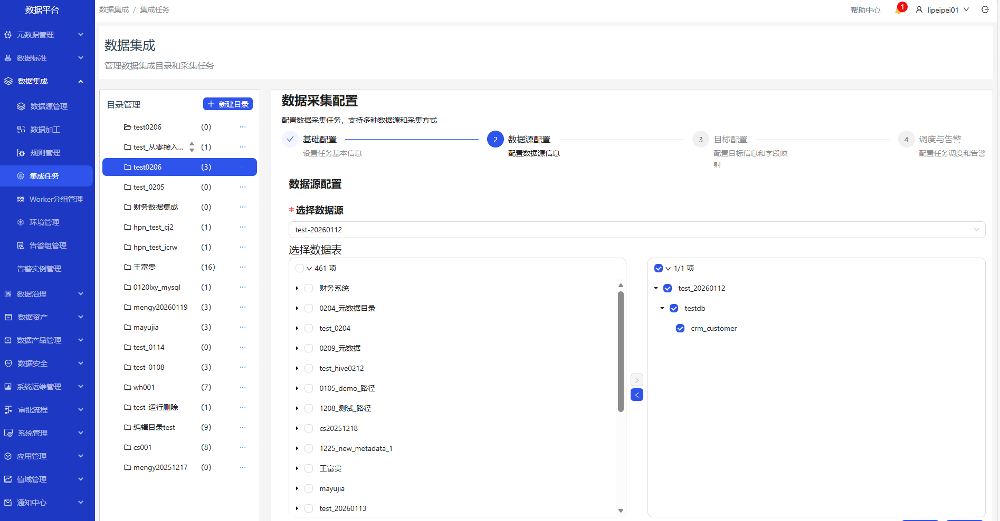
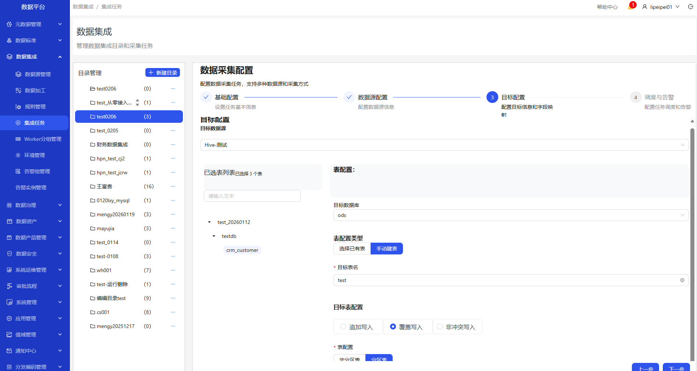

#### API接口类型任务

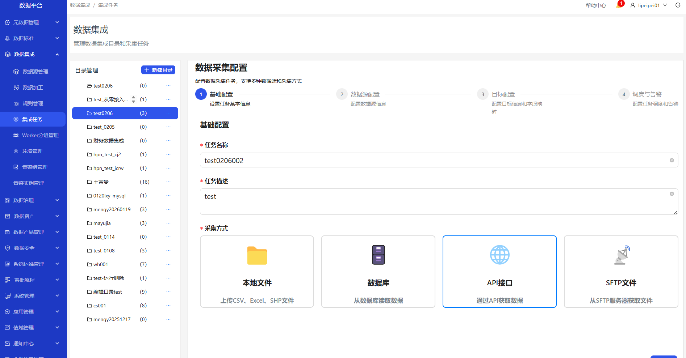

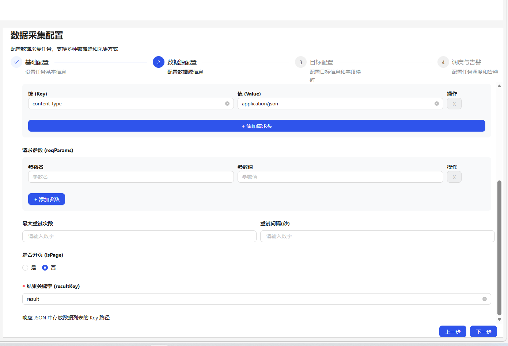
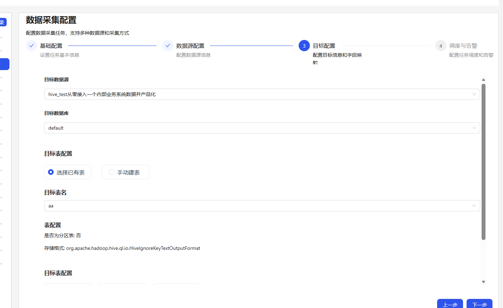

#### SFTP文件类型任务
