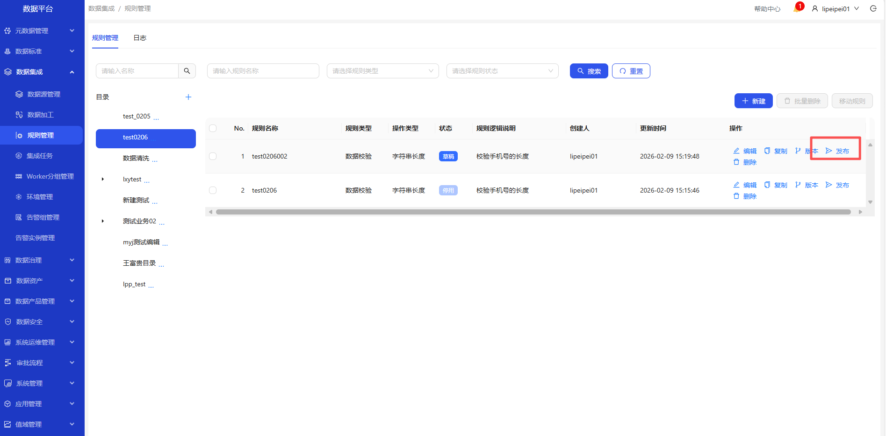
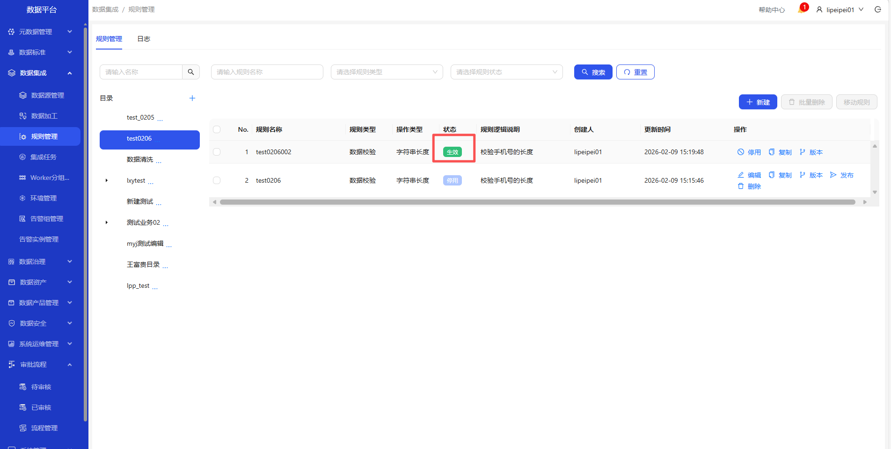

# 规则管理
操作界面示例截图（按步骤依次操作）

&emsp;
&emsp;
&emsp;
&emsp;
&emsp;
&emsp;

&emsp;

&emsp;1. 进入数据集成-规则管理页面\
&emsp;2. 点击+，创建规则目录\
&emsp;3. 选中创建的目录，点击新建，填写完整的数据，测试通过后点击确定按钮，成功新增规则\
&emsp;4. 新建的规则，点击发布\
&emsp;5. 审批通过后，状态更新为生效\
&emsp;6. 可停用(停用后，状态为待审批，需要重新审批)、复制新建的规则；可查看该规则的版本\
&emsp;7. 可删除规则(状态为草稿)