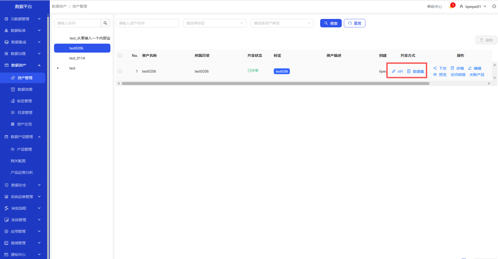
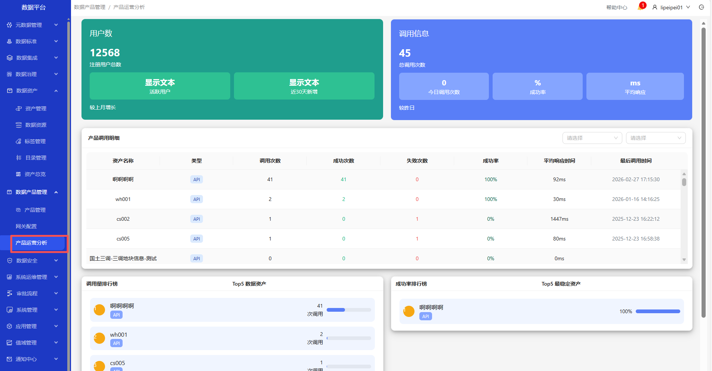

# 数据产品管理

### 流程总览图

&emsp;

操作界面示例截图（按步骤依次操作）

&emsp;
&emsp;
&emsp;
&emsp;
&emsp;
&emsp;

&emsp;
&emsp;
&emsp;
&emsp;
&emsp;

&emsp;1. 进入数据资产-资产管理页面\
&emsp;2. 在共享方式列，点击API、数据集，共享产品\
&emsp;3. 进入数据产品管理-产品管理页面，查看产品列表\
&emsp;4. 可查看产品详情，订阅详情\
&emsp;5. 可编辑产品（API类型），对产品进行上下架\
&emsp;6. 进入数据产品管理-产品运营分析页面，可查看用户数、调用信息、调用排行榜等信息