# 数据标准

### 流程总览图

&emsp;

## 标准附件管理
操作界面示例截图（按步骤依次操作）

&emsp;
&emsp;
&emsp;
&emsp;
&emsp;
&emsp;

&emsp;1. 进入数据标准-标准附件管理页面\
&emsp;2. 点击新建目录按钮，新建目录\
&emsp;3. 选中新建的目录，点击上传附件按钮，可上传附件\
&emsp;4. 可对已上传的附件进行删除、下载、替换\
&emsp;5. 在列表选中一条或者多条数据，可批量删除、批量下载

## 标准集属性
操作界面示例截图（按步骤依次操作）

&emsp;
&emsp;

&emsp;1. 进入数据标准-标准集属性页面\
&emsp;2. 点击新建按钮，添加标准集属性\
&emsp;3. 可删除、编辑新建的标准集属性

## 起草标准
操作界面示例截图（按步骤依次操作）

&emsp;
&emsp;
&emsp;
&emsp;
&emsp;
&emsp;

&emsp;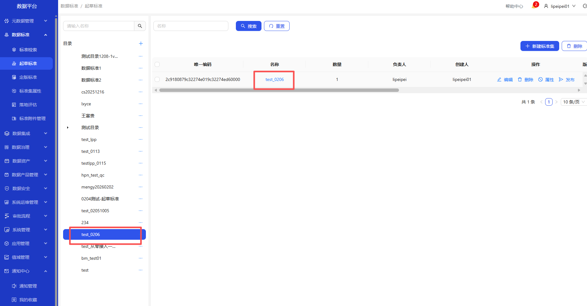
&emsp;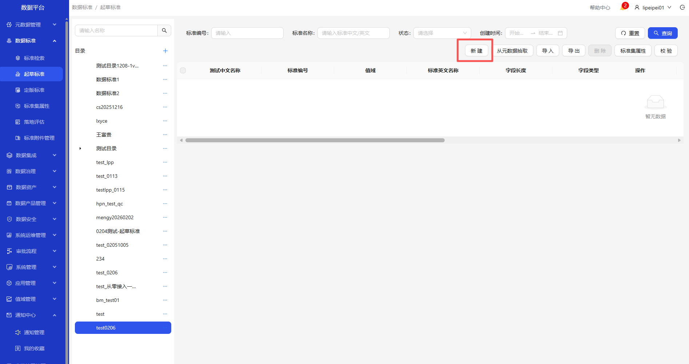
&emsp;

&emsp;1. 进入数据标准-起草标准页面\
&emsp;2. 点击+，新建目录\
&emsp;3. 选中新建的目录，点击新建标准集按钮，新建标准集\
&emsp;4. 参考标准文档可选择标准附件管理上传的文件，添加标准集属性\
&emsp;5. 新建的标准集，点发布按钮，定版路径输入定版标准建立的目录\
&emsp;6. 新建的标准集可编辑、删除、查看属性\
&emsp;7. 选中新建的标准集，点击名称\
&emsp;8. 点击新建按钮，添加标准

## 定版标准
操作界面示例截图（按步骤依次操作）

&emsp;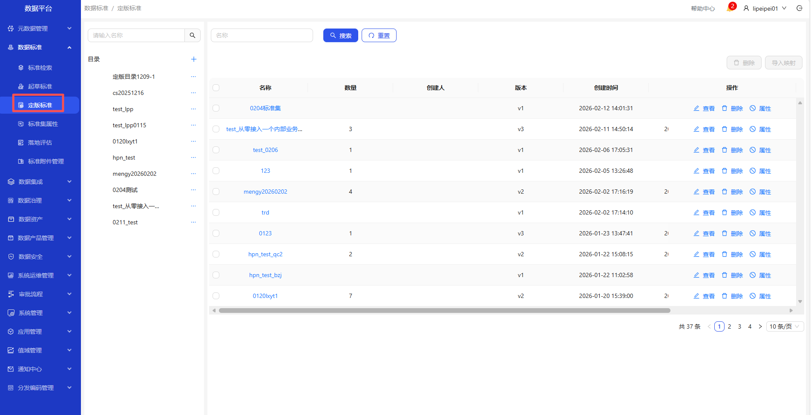
&emsp;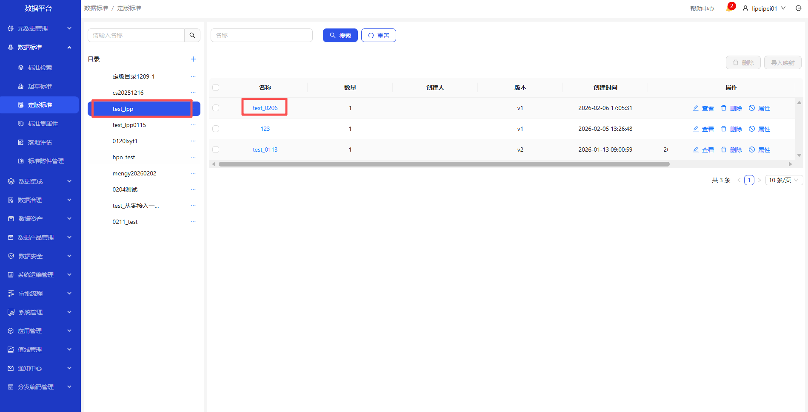
&emsp;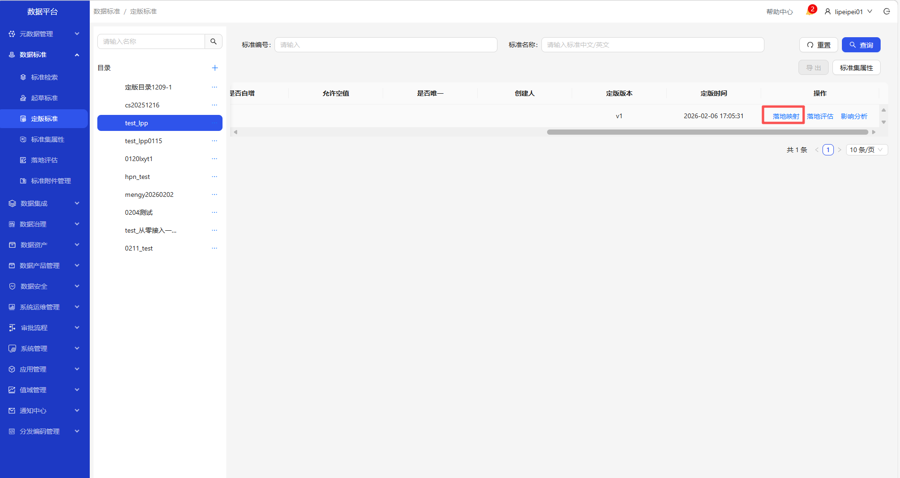
&emsp;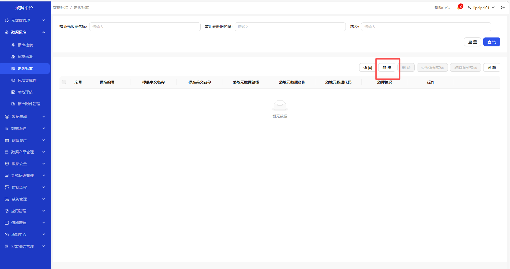
&emsp;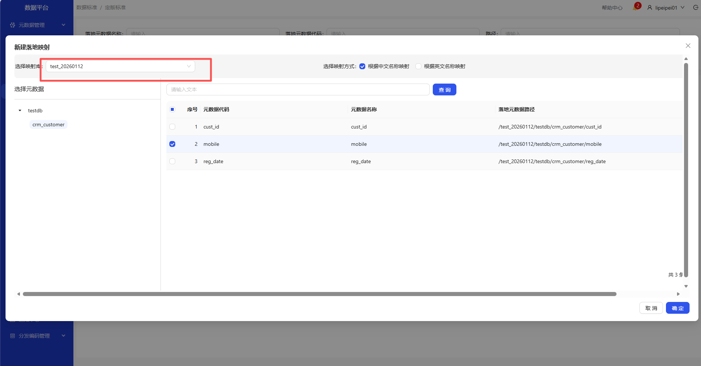
&emsp;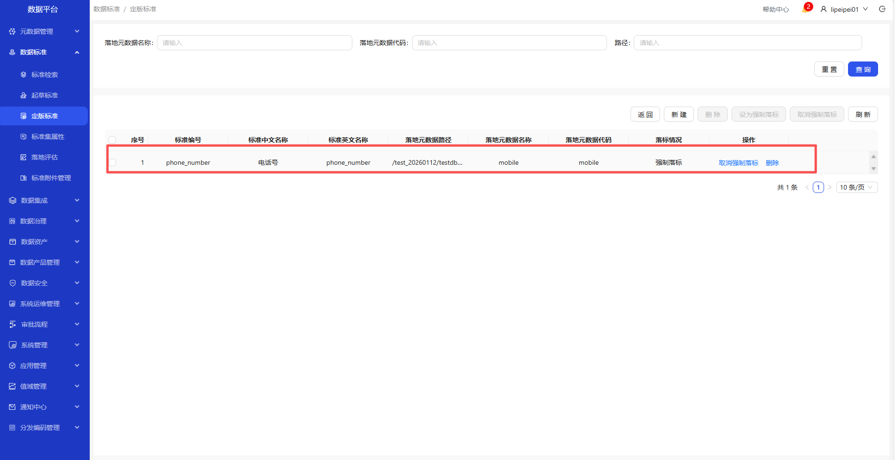

&emsp;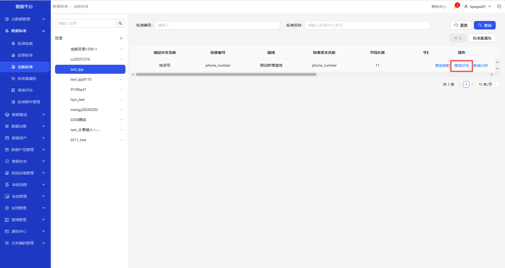
&emsp;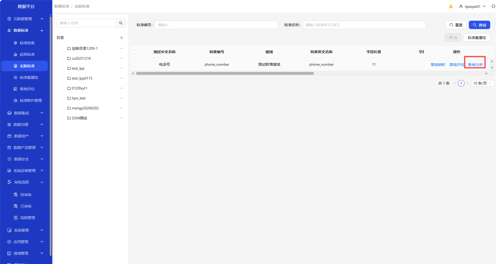
&emsp;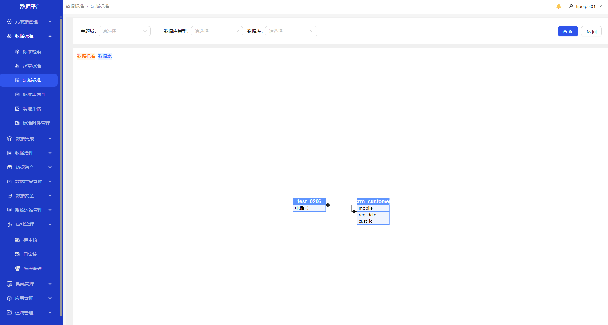

&emsp;1. 进入数据标准-定版标准页面\
&emsp;2. 选中定版标准目录，点击标准集名称\
&emsp;3. 点击落地映射按钮\
&emsp;4. 点击新建按钮，新建映射\
&emsp;5. 选择映射库、映射方式、勾选需要映射的字段后，点击确定\
&emsp;6. 点击落地评估，可查看评估详情\
&emsp;7. 点击影响分析，查看该标准影响哪些数据表

## 落地评估
操作界面示例截图（按步骤依次操作）

&emsp;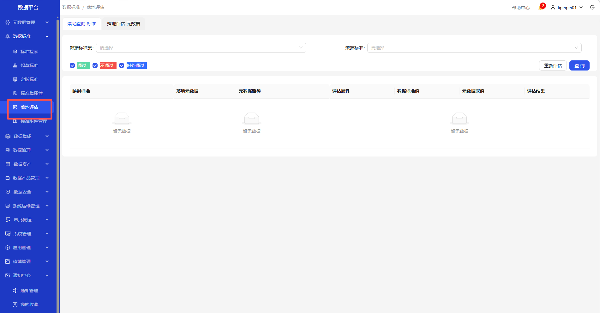
&emsp;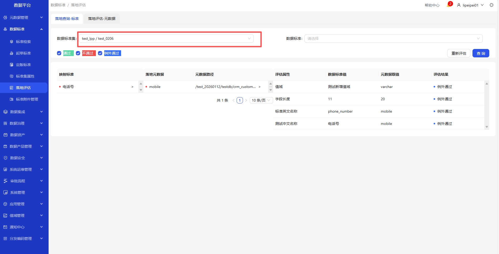

&emsp;1. 进入数据标准-落地评估页面\
&emsp;2. 选择标准集，点击查询按钮，展示评估详情

## 标准检索
操作界面示例截图（按步骤依次操作）

&emsp;
&emsp;
&emsp;

&emsp;1. 进入数据标准-标准检索\
&emsp;2. 点击定位\
&emsp;3. 快速跳转至起草标准对应的标准集