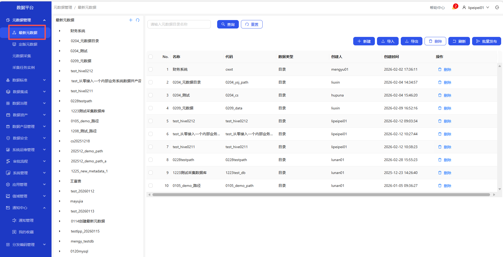
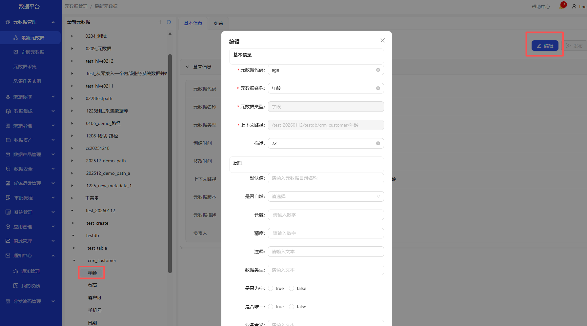
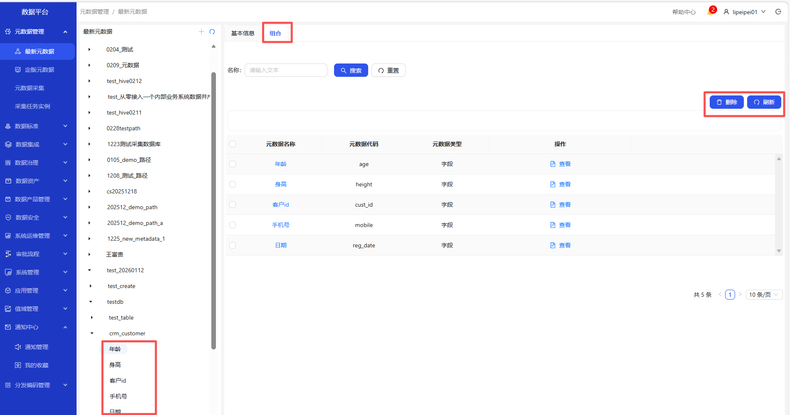
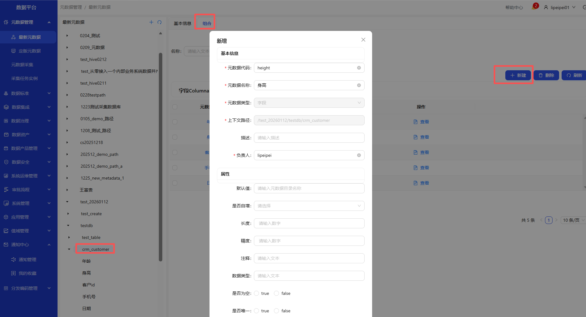

# 元数据管理

### 流程总览图

&emsp;

## 元数据管理
### 最新元数据
操作界面示例截图（按步骤依次操作）

&emsp;
&emsp;
&emsp;
&emsp;
&emsp;
&emsp;

&emsp;
&emsp;
&emsp;
&emsp;
&emsp;
&emsp;

&emsp;
&emsp;
&emsp;
&emsp;
&emsp;
&emsp;

&emsp;
&emsp;

&emsp;1. 进入元数据管理-最新元数据页面\
&emsp;2. 点击+或者新建按钮，新增元数据目录\
&emsp;3. 元数据目录新建成功后，可查询、删除、刷新\
&emsp;4. 选中元数据目录且标签选择基本信息，可进行编辑、发布\
&emsp;5. 选中元数据目录下的数据库/表/表中的字段且标签选择基本信息，可进行编辑\
&emsp;6. 选中元数据目录且标签选择组合，点击新建按钮，可新建、删除、刷新数据库\
&emsp;7. 选中数据库且标签选择组合，点击新建按钮，可新建、删除、刷新表\
&emsp;8. 选中表且标签选择组合，可新建、删除、刷新字段或者主键\
&emsp;9. 选中表中的字段且标签选择组合，可删除、刷新字段\
&emsp;10. 在列表选中一条或者多条元数据，点击导出按钮，可下载文件\
&emsp;11. 点击导入按钮，下载模板文件，填写数据后导入文件

### 定版元数据
操作界面示例截图（按步骤依次操作）

&emsp;
&emsp;
&emsp;

&emsp;1. 进入元数据管理-定版元数据页面\
&emsp;2. 选中表中的字段，标签选择数据标准\
&emsp;3. 点击新建，可关联数据标准

## 元数据采集
操作界面示例截图（按步骤依次操作）

&emsp;
&emsp;
&emsp;
&emsp;

&emsp;1. 进入元数据管理-元数据采集页面\
&emsp;2. 点击新建按钮，选择数据源、元数据类型、挂载目录，采集元数据\
&emsp;3. 可对元数据编辑、删除、停用\
&emsp;4. 点击立即执行，进入元数据管理-采集任务实例查看
 