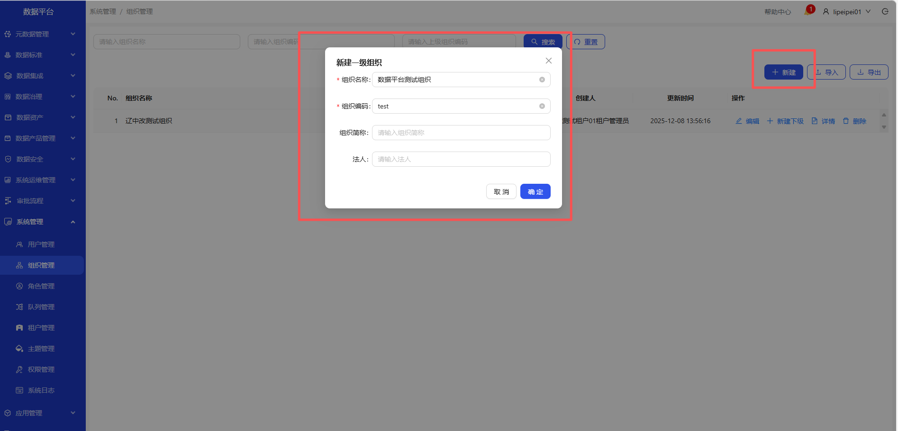

# 组织管理
操作界面示例截图（按步骤依次操作）

&emsp;
&emsp;
&emsp;
&emsp;
&emsp;
&emsp;

&emsp;
&emsp;
&emsp;
&emsp;

&emsp;1. 进入系统管理-组织管理页面\
&emsp;2. 点击新建按钮，可新建组织\
&emsp;3. 在操作列，可编辑、查看详情、新建下级、删除等操作\
&emsp;4. 点击导出按钮，下载文件，打开可查看数据\
&emsp;5. 点击下载模板，下载模板文件，填写要导入的数据\
&emsp;6. 点击导入文件，上传模板文件