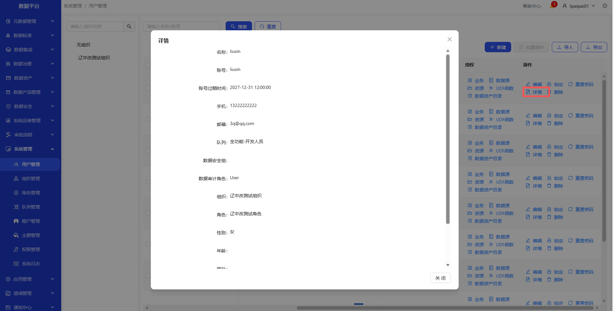

# 用户管理
操作界面示例截图（按步骤依次操作）

&emsp;
&emsp;
&emsp;
&emsp;
&emsp;
&emsp;

&emsp;
&emsp;
&emsp;
&emsp;
&emsp;
&emsp;

&emsp;1. 进入系统管理-用户管理页面\
&emsp;2. 点击新建按钮，新增用户\
&emsp;3. 点击详情按钮，可查看用户详情\
&emsp;4. 点击删除按钮，删除用户\
&emsp;5. 在授权列，点击业务、数据源、UDF函数、数据资产目录、资源，给用户授权\
&emsp;6. 在操作列，可编辑、查看详情、锁定、重置密码、删除等操作